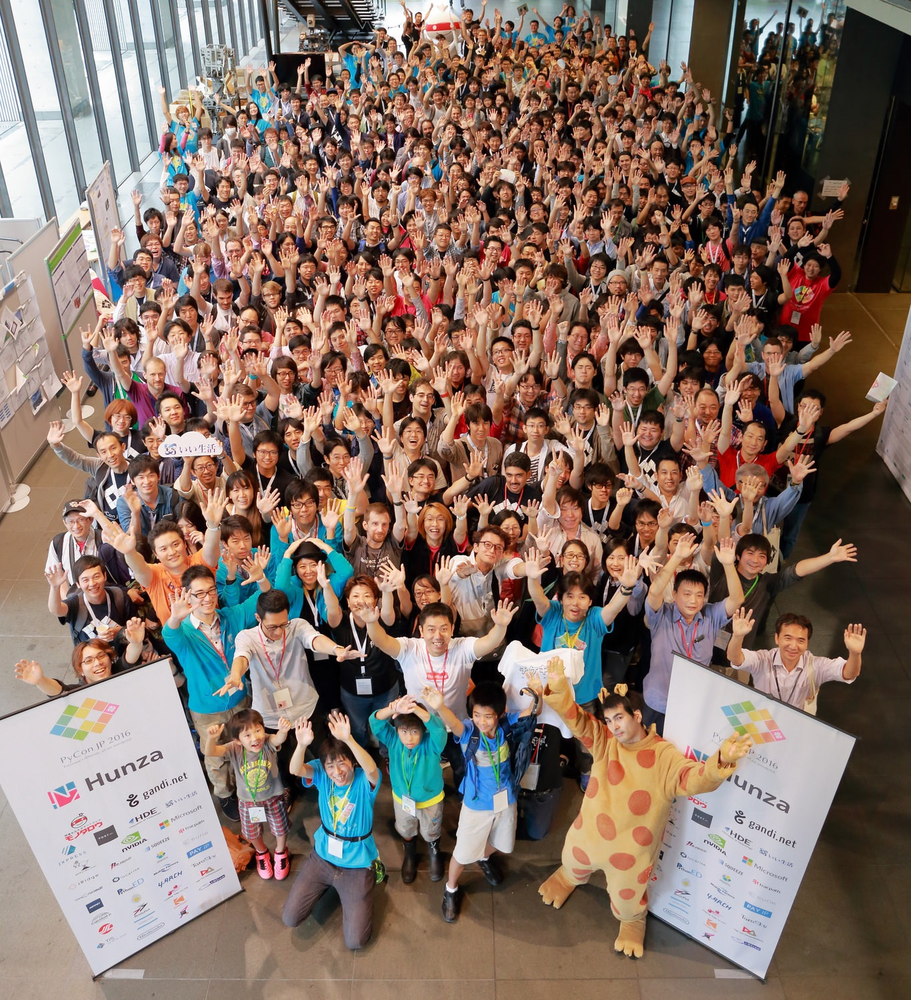

# Python の動向

## 1. Python の特徴

### Python とは

- スクリプト言語の 1 つ
- Python という名前は、イギリスのコメティグループ「モンティ・パイソン」が由来
- 英語でニシキヘビという意味の為、ヘビをあしらったアイコンがよく利用されている


- Python はフリーでオープンソースのソフトウェアなのでコミュニティで開発が進められている
  - PSF(Python Software Foundation)という非営利団体が Python のソースコード、ロゴなどの知的財産権を管理している

#### PSF の活動

1. US PyCon の開催
1. 世界中の Python カンファレンスのサポート
1. Python 関連プロジェクトへの助成金プログラムの運営

### Python の特徴

- さまざまなプラットフォームで動作
  - Linux(Ubuntu)
  - macOS
  - Windows
- 標準ライブラリが豊富に用意されている(Python の「バッテリー付属(Batteries Included)」という哲学を反映している)
  - 正規表現
  - 数学関数
  - 通信プロトコル
  - GUI(Graphical User Interface)フレームワーク
- Python は「シンプルで読みやすいコード」
  - ブロック構造をインデントで表記
    - `for`ループや`if`文のブロックをインデントで記述
    - ソースコードの形を見るだけでブロック構造を把握出来る

```Python
for i in range(10):
    if i % 5 == 0:
        print('ham')
    elif i % 3 == 0:
        print('eggs')
    else:
        print('spam')
```

### PEP

- **PEP**(Python Enhancement Proposals: Python 拡張の提案)
  - 拡張機能の採用可否を決める手順

1. アイデア
   - Python 言語で拡張したい内容などのアイデアを思いつく
1. ドキュメント
   - アイデアについてドキュメントにまとめる。このドキュメントを「PEP」と呼ぶ
   - 規定のフォーマットがあり必要事項を記述
     - 概要
     - なぜそのアイデアが必要なのか
     - 後方互換性
     - その他
1. レビュー
   - 提案された PEP ドキュメントを Python 開発者がレビュー、コメント
1. 採用
   - PEP が採用されると、実際にコードの作成などを実施

- PEP プロセスの説明は「PEP 1 - PEP Purpose and Guidelines」で公開されている
  - [PEP 1 - PEP Purpose and Guidelines(日本語訳) | Sphinx の日本ユーザ会](http://sphinx-users.jp/articles/pep1.html)
- PEP の一覧は、PSF のサイトの[「PEP 0 - Index of Python Enhancement Proposals (PEPs)」](https://www.python.org/dev/peps)で参照可能

### The Zen of Python

- [PEP 20 - The Zen of Python](https://www.python.org/dev/peps/pep-0020/)という文書がある
  - Python 開発者ティム・ピータース(Tim Peters)氏が「Python らしさ(pythonic)」を表す格言をまとめたもの
  - Python の対話モードで「**import this**」と入力すると PEP 20 の全文が読める
- [The Zen of Python 解題 - 前編](http://atsuoishimoto.hatenablog.com/entry/20100920/1284986066)
- [The Zen of Python 解題 - 後編](https://atsuoishimoto.hatenablog.com/entry/20100926/1285508015)

### Python の生みの親: グイド・ヴァンロッサム

- オリジナルの Python 開発者[グイド・ヴァンロッサム](https://gvanrossum.github.io/)
  - Python コミュニティでは"Benevolent Dictator for Life"(**BDFL**: 慈悲深き終身独裁者)と呼ばれており、Python 開発に関わる事案について決定を下す役割を担っている

#### 他のオープンソース開発コミュニティの BDFL

- リーナス・トーバルズ(Linus Torvalds): Linux
- パトリック・フォルカーディン(Patrick Volkerding): Slackware
- ラリー・ウォール(Larry Wall): Perl
- ラスマス・ラードフ(Rasmus Lerdorf): PHP
- ドリス・バイタルト(Dries Buytaert): Drupal

### 様々な Python 実装

- **CPython**: C 言語で書かれている通常の Python 実装
- **Jython**: Java 仮想マシン(JVM)上で動作する Python。Python から Java のライブラリが使用できる [http://www.jython.org/](http://www.jython.org/)
- **IronPython**: .NET Framework 上で動作する Python。.NET Framework のライブラリが使用できる [http://ironpython.net/](http://ironpython.net/)
- **PyPy**: Python に制約を加えた RPython で実装された Python。JIT(Just-in-Time)コンパイラにより高速化されている [http://pypy.org/](http://pypy.org/)

## 2. Python の歴史

### Python 1 系

- Python はグイド・ヴァンロッサム(Guido van Rossum)氏によって開発
- 1991 年に netnews(今でいう電子掲示板のようなもの)に Python 0.9.0 のソースコードが公開され、一般に知られるようになる
  - `list`, `dict`, `str`は 0.9.0 から存在している
- 1994 年 1 月に Python 1.0 がリリース
  - 関数プログラミングツール`lambda`, `map`, `filter`, `reduce`が追加
  - Python 1 系は 2000 年の Python 1.6 まで継続的に開発された

※現在、Python 1 系はサポートされていないため、使用しない事

### Python 2 系

- Python 2.0 は 2000 年にリリース
  - 新機能として、リスト内包表記や Unicode 型がある
  - PEP プロセスがこのバージョンから導入される
- Python 2.6/2.7 では、Python 3 系の新機能が一部導入(バックポート)されている
  - Python 2 系から 3 系への移行をスムーズに進めるための措置
  - 主な機能として、辞書と集合の内包表記、順序付き辞書(OrderedDict)、数値の 3 桁区切りのための書式指定子がバックポートされている
- 2016 年 12 月にリリースされた 2.7.13 が Python 2 系の最新バージョン
  - Python 2.7 は 2 系の最後のメジャーリリース
    - Python 2.8 はリリースされない「[PEP 404 - Python 2.8 Un-release Schedule](https://www.python.org/dev/peps/pep-0404/)」より

### Python 3 系

- 2008 年に Pytnon 3.0 がリリース
  - 「シンプルで読みやすいコードが書けること」を実現する為に、Python 2 系との後方互換性をなくす選択をした(Python 2 系は 1 系との後方互換性がある)
- Python 3 系は当初「Python 3000」という名前で、西暦 3000 年にリリース予定の Python の理想型として呼ばれていた
  - Python 3 系の開発状況は「[PEP 3000 - Python 3000](https://www.python.org/dev/peps/pep-3000/)」にまとめられている

Python のリリース日

| バージョン 1 系 | リリース日 | バージョン 2 系 | リリース日 | バージョン 3 系 | リリース日 |
| :-------------- | :--------- | :-------------- | :--------- | :-------------- | :--------- |
| 0.9.0           | 1991/02/20 | 2.0             | 2000/10/16 | 3.0             | 2008/12/03 |
| 1.0             | 1994/01/26 | 2.1             | 2001/04/15 | 3.1             | 2009/06/27 |
| 1.1             | 1994/10/11 | 2.2             | 2001/12/21 | 3.2             | 2011/02/20 |
| 1.2             | 1995/04/13 | 2.3             | 2003/07/29 | 3.3.0           | 2012/09/29 |
| 1.3             | 1995/10/13 | 2.4             | 2004/11/30 | 3.4.0           | 2014/03/16 |
| 1.4             | 1996/10/25 | 2.5             | 2006/09/19 | 3.5.0           | 2015/09/13 |
| 1.5             | 1998/02/11 | 2.6             | 2008/10/01 | 3.6.0           | 2016/12/23 |
| 1.6             | 2000/09/05 | 2.7             | 2010/07/03 | 3.6.2           | 2017/07/17 |
|                 |            | 2.7.13          | 2016/12/23 |                 |            |

- 3 系では後方互換性を排したことにより、多数の機能追加、変更が行われている
  - 詳細な追加機能については「[What's New in Python](http://docs.python.jp/3/whatsnew/index.html)」

### Python 2 系と 3 系の違い

- Python 2 系と 3 系はどちらも利用されている
  - 3 系は後方互換性がない為、どちらのバージョンを使用するかの選択が重要

#### 2 系と 3 系の主な違い

##### print が文から関数に変更

文字列を出力する`print`は、2 系では文だったが、3 系では関数となった。

```Python
# Python 2系のprint文
>>> print # 空行を出力

>>> print 'Hello Python 2!'
Hello Python 2!
```

```Python
# Python 3系のprint文
>>> print() # 空行を出力

>>> print('Hello Python 3!')
Hello Python 3!
```

##### 文字列が Unicode 文字列に統一

2 系の文字列には、**非 Unicode 文字列**(`str`型)と**Unicode 文字列**(`unicode`型)の 2 種類が存在する。3 系では**Unicode 文字列**(`str`型)に統一された。

```Python
# Python 2系の2種類の文字列
>>> type('str文字列')
<type 'str'>
>>> type(u'unicode文字列')
<type 'unicode'>
```

```Python
# Python 3系の文字列は1種類
>>> type('str文字列')
<class 'str'>
>>> type(u'unicode文字列')
<class 'str'>
```

##### 整数同士の割り算結果が実数に変更

2 系では整数同士の割り算の結果は必ず整数(端数切り捨て)だが、3 系では浮動小数点数となる。

```Python
# Python 2系の割り算
>>> 4 / 2
2
>>> 1 / 3
0
```

```Python
# Python 3系の割り算
>>> 4 / 2
2.0
>>> 1 / 3
0.3333333333333333
```

Python 3 系で 2 系と同様の商が整数となる割り算を行うには、`//`演算子を使用する。

```Python 3系での整数の割り算
>>> 4 // 2
2
>>> 1 // 3
0
```

##### 標準ライブラリの再構成

Python 3 系では、標準ライブラリの名前や構成が変更されている。

構成が変更された主な標準ライブラリ

| Python 2 系                                         | Python 3 系                                    | 説明                                                                   |
| :-------------------------------------------------- | :--------------------------------------------- | :--------------------------------------------------------------------- |
| BaseHTTPServer<br>SimpleHTTPServer<br>CGIHTTPServer | http.server                                    | 基本的な HTTP サーバー機能のライブラリは http.server に統合された      |
| urllib<br>urllib2<br>urlparse                       | urllib.request<br>urllib.parse<br>urllib.error | URL へのアクセスや構文解析のためのライブラリは urllib.\*に再構成された |
| StringIO<br>cStringIO                               | io                                             | テキスト I/O は io モジュールの StringIO クラスに統合された            |
| ConfigParser                                        | configparser                                   | 設定ファイルのパーサーは名前が変更された                               |

### どちらを使うべきか

Python 2 系と 3 系には文法の変更を含む多くの違いがあるため、どちらを使うべきかの判断は、いくつかのパターンが考えられる。

#### パターン 1: 既存のプロジェクトを引き継ぐ

- 既存のプロジェクトを引き継ぐ場合、現在使用しているバージョンをそのまま使用
- セキュリティ上の問題がなければ、急いで移行する必要はない
  - Python 2 系のサポートは 2020 年で終わるため、3 系への移行を計画的に進めることを推奨

#### パターン 2: 使用するパッケージが Python バージョンに依存している

- サードパーティ製パッケージが特定のバージョンに依存している場合、そのバージョンを使用
  - 対象となるパッケージが 2 系に依存している場合、将来的に 3 系に対応した段階で移行を計画することを推奨

#### パターン 3: 新規のプロジェクトで依存ライブラリの問題がない場合

- 新規プロジェクトで依存の問題もない場合、Python 3 系を使用することを推奨
  - Python 2.7 のサポートが 2020 年で終了すると「[PEP 373 - Python 2.7 Release Schedule](https://www.python.org/dev/peps/pep-0373/)」で宣言されているため

## 3. Python のコミュニティ

### PyCon

- PyCon (Python Conference)は Python に関する国際会議
  - PSF 主催の US PyCon の他、世界各国の Python コミュニティ主催で PyCon が開催されている
- カンファレンスでは、トークセッション、基調講演やライトニングトークなどが行われる
  - 参加者は発表を聞き、ランチや休憩時間に他の参加者と交流するなど、思い思いに楽しむ
- カンファレンス以外に「チュートリアル」や「開発スプリント」が開催されることが特色の 1 つ
  - チュートリアルでは、講師からハンズオン形式で技術を深く学ぶことができる
  - 開発スプリントではテーマ毎に集まり、開発を進める

#### PyCon JP

- 日本では 2011 年から PyCon JP を開催している
  - 徐々に規模が拡大して、2013 年には PyCon APAC(アジア太平洋地域)を日本で開催
  - 参加者、トークセッションとも日本人、日本語が中心だが、英語のセッションや海外からの参加者もいて、Python ユーザーの国際交流の場にもなっている
- 過去の PyCon JP の開催実績は「[PyCon JP 運営](http://www.pycon.jp/)」を参照



#### PyCon APAC

- 日本を含むアジア太平洋地域では PyCon APAC (Asia-Pacific)という名前で、各国持ち回りで広域を対象としたカンファレンスを開催
- 2010 年の当初はシンガポールのみで開催
  - アジア太平洋地域で PyCon を開催している国は非常に少なかった為と思われる
- 各地域の PyCon 主催者が一堂に会し、これからの PyCon について議論したり交流を深めている

#### 世界の PyCon

- 1 年間に約 30 の国と地域で開催されている
  - 世界中の PyCon の情報は「[PyCon - Connecting the Python Community](http://www.pycon.org/)」で参照できる

### 日本のコミュニティ

- [python.jp](http://www.python.jp/)
- [PythonJP(Facebook)](https://www.facebook.com/groups/335609466475226)

#### Python Boot Camp

- 初心者向けに半日で Python の入門を行うチュートリアルイベント
  - [Python Boot Camp (初心者向け Python チュートリアル)](https://www.pycon.jp/support/bootcamp.html)
- チュートリアルのテキストは、クリエイティブ・コモンズ・ライセンスの CC BY 4.0(表示 4.0 国際)で公開されている為、独習などの用途にも利用できる
  - [Python Boot Camp Text](http://pycamp.pycon.jp/)

#### プロダクト系コミュニティ

- [Sphinx-users.jp](http://sphinx-users.jp/)
- [Plone User's Group Japan](http://plone.jp/)
- [djangoproject.jp](http://djangoproject.jp/)
- [PyData.Tokyo](https://pydatatokyo.connpass.com/)
- [Ansible ユーザー会](http://ansible-users.connpass.com/)

#### 初心者向けコミュニティ

- [Start Python Club](https://startpython.connpass.com/)
- [Python 入門者の集い](https://python-nyumon.connpass.com/)

#### 女性向けコミュニティ

- [PyLadies Tokyo](https://pyladies-tokyo.connpass.com/)
- [DjangoGiris Japan](https://djangogirls-org.connpass.com/)

#### ハッカソン系コミュニティ

- [Python mini Hack-a-thon](http://pyhack.connpass.com/)
- [Python もくもく会](http://mokupy.connpass.com/)
- [タネマキ GAE](https://tanemaki-gae.connpass.com/)
